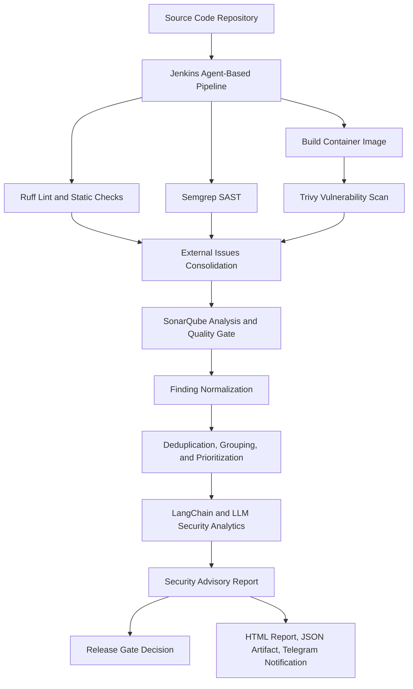

# Intelligent DevSecOps Automation Framework

An **AI-driven DevSecOps automation framework** for agent-based Jenkins pipelines. This repository implements the prototype described in the research paper:

**"An Intelligent DevSecOps Automation Framework for AI-Driven Security Analytics in Agent-Based Jenkins Pipelines"**

The framework integrates multiple security tools into a single CI/CD flow, normalizes heterogeneous findings, consolidates duplicated issues, prioritizes security risk, and generates an AI-assisted security advisory to support remediation and release decisions.

## Overview

Modern DevSecOps pipelines often produce fragmented outputs from different scanners. Ruff, Semgrep, SonarQube, and Trivy each report findings with different structures, severities, and scopes. This project addresses that gap by adding an orchestration and advisory layer on top of multi-tool scanning.

The framework is designed to:

- Execute security checks automatically inside an agent-based Jenkins pipeline.
- Integrate Ruff, Semgrep, SonarQube, and Trivy into one security workflow.
- Convert scanner outputs into SonarQube external issues where applicable.
- Normalize, deduplicate, group, and prioritize security findings.
- Apply security quality gate and release gate logic.
- Use LangChain and an LLM to produce contextual security advisory output.
- Publish advisory results as HTML reports, JSON artifacts, and Telegram notifications.

The LLM is not used as the primary vulnerability detector. Detection remains the responsibility of deterministic security tools. The LLM acts as an analytical layer that explains risk, summarizes context, and recommends remediation actions based on consolidated findings.

## Research Contribution

This repository supports an applied research prototype with the following contributions:

| Contribution | Description |
| --- | --- |
| Multi-tool DevSecOps pipeline | Integrates code quality, SAST, static analysis, and vulnerability scanning in a single Jenkins flow. |
| Finding normalization | Converts heterogeneous scanner output into a consistent finding representation. |
| Deduplication and prioritization | Reduces redundant findings and selects high-impact issues for downstream analysis. |
| AI-driven security analytics | Uses LangChain and LLM-based analysis to create contextual advisory output. |
| Release decision support | Produces risk status, release blockers, and release recommendation for CI/CD gating. |

## Architecture



## Pipeline Flow

The service pipeline in `ci-cd/pipelines/services/payment-service.groovy` executes the following stages:

1. Initialize pipeline context from webhook or upstream job parameters.
2. Checkout source code by tag and capture workspace baseline.
3. Run Ruff for Python linting and static checks.
4. Run Semgrep with security-audit, OWASP Top Ten, and CWE Top 25 rulesets.
5. Verify workspace integrity.
6. Build and push container image.
7. Run Trivy against the built image.
8. Consolidate Ruff, Semgrep, and Trivy outputs into SonarQube external issue payloads.
9. Run SonarQube code quality and quality gate analysis.
10. Run AI-driven security advisory generation.
11. Publish advisory report and send Telegram notification.
12. Deploy only when the advisory recommendation allows release.

## Repository Structure

```text
.
|-- ai-advisory-platform/        # Python advisory service using LangChain and LLM integration
|-- ci-cd/
|   |-- jenkins-shared-library/  # Jenkins shared library for scanners, gates, and notifications
|   `-- pipelines/               # Jenkins pipeline definitions
|-- config/                      # CI, environment, severity, SLA, and gate policy examples
|-- docs/                        # Architecture diagrams and ADR documents
|-- example/                     # Example applications, workflows, and AI experiments
`-- infrastructure/              # Jenkins, SonarQube, PostgreSQL, Nginx report portal, GitOps assets
```

## Core Components

| Component | Role |
| --- | --- |
| Jenkins | Main CI/CD orchestrator using agent-based execution. |
| Ruff | Python linting and selected static checks. |
| Semgrep | SAST scanner using security-focused rulesets. |
| Trivy | Container and vulnerability scanner. |
| SonarQube | Code quality analysis, external issue aggregation, and quality gate. |
| AI Advisory Platform | Python service that analyzes SonarQube findings and generates advisory reports. |
| LangChain | Orchestrates prompt construction and LLM interaction. |
| LLM | Generates contextual risk interpretation and remediation guidance. |
| Telegram | Sends pipeline and advisory summary notifications. |
| Nginx Report Portal | Serves generated HTML security advisory reports. |

## AI Advisory Platform

The AI advisory service is located in `ai-advisory-platform/`. It fetches SonarQube findings, normalizes and prioritizes them, routes the request to the selected analysis chain, and writes both HTML and JSON advisory output.

Supported analysis modes are defined in the application constants and prompts. The Jenkins shared library currently invokes:

```bash
python -m app.main \
  --project-key payment-service \
  --analysis-mode critical_analysis \
  --sonar-url http://sonarqube:9000 \
  --output-file advisory_report.json \
  --report-dir payment-service-critical-analysis
```

For local development:

```bash
cd ai-advisory-platform
python3 -m venv .venv
source .venv/bin/activate
pip install -r requirements.txt
make run
```

Required environment values, including LLM credentials and SonarQube connectivity, should be provided through the local `.env` files or runtime environment variables.

## Infrastructure

The infrastructure folder contains Docker-based services for running the local research prototype. This README only covers the Docker runtime assets under `infrastructure/` and intentionally excludes the OpenShift GitOps manifests under `infrastructure/gitops-ocp/`.

The active Docker Compose stack currently includes:

| Service | Purpose | Default Access |
| --- | --- | --- |
| `jenkins` | CI/CD orchestrator for the DevSecOps pipeline. | `http://localhost:${JENKINS_HTTP_PORT}` |
| `sonar-db` | PostgreSQL database for SonarQube. | Internal Docker network only |
| `sonarqube` | Static analysis, external issue aggregation, and quality gate. | `http://localhost:${SONARQUBE_PORT}` |
| `nginx-report` | Static web portal for generated advisory reports. | `http://localhost` |

### Prerequisites

- Docker Engine or Docker Desktop.
- Docker Compose v2.
- Access to the Docker socket from Jenkins, because the pipeline runs scanner and advisory containers with `docker run`.
- Enough memory for SonarQube. Allocate at least 4 GB to Docker for a smoother local run.
- Valid environment values in `infrastructure/.env`.
- LLM/API credentials configured for `ai-advisory-platform` before running AI advisory analysis.

### Environment Configuration

The Compose file reads runtime values from `infrastructure/.env`. At minimum, review these keys:

```text
TZ
JENKINS_HTTP_PORT
SONARQUBE_PORT
SONARQUBE_JDBC_URL
SONARQUBE_JDBC_USERNAME
SONARQUBE_JDBC_PASSWORD
SONARQUBE_JAVA_XMX
```

The current Compose file also contains workstation-specific volume paths, for example Jenkins workspace and report directories. Adjust them before running on another machine:

```yaml
volumes:
  - /path/to/jenkins_data/ci-workspace:/ci-workspace
  - /path/to/jenkins_data/report-ai-advisory:/report:ro
```

The Jenkins shared library also uses `ci-cd/jenkins-shared-library/resources/docker-config.yaml` to resolve Docker workspace mounts:

```yaml
docker:
  network: infrastructure_default
  base_host_path: /Users/risko/Data/tools/jenkins_data
  workspace_mount:
    container_path: /ci-workspace
    mode: rw
```

Keep `base_host_path`, the Compose Jenkins workspace volume, and the report volume aligned. If these paths point to different host directories, Jenkins may run but scanner/advisory containers will not see the expected workspace or report files.

### Build the AI Advisory Runtime Image

The Jenkins shared library expects this image name:

```text
ai-runner-advisory:v1.0.0
```

Build it from the AI advisory platform directory:

```bash
cd ai-advisory-platform
docker build -f docker/Dockerfile -t ai-runner-advisory:v1.0.0 .
```

The Dockerfile copies the application source, prompts, configs, and local `.env` into the image. For shared or production environments, prefer injecting secrets at runtime instead of baking sensitive values into an image.

### Start the Docker Compose Stack

```bash
cd infrastructure
docker compose --env-file .env up -d --build
```

Check container status:

```bash
docker compose --env-file .env ps
```

Follow logs during startup:

```bash
docker compose --env-file .env logs -f jenkins sonarqube sonar-db nginx-report
```

### Access the Local Services

After startup, use the configured ports:

- Jenkins: `http://localhost:${JENKINS_HTTP_PORT}`
- SonarQube: `http://localhost:${SONARQUBE_PORT}`
- Report portal: `http://localhost`

SonarQube can take several minutes to become ready on the first run. Jenkins depends on SonarQube in Compose, but successful container startup does not always mean SonarQube is immediately ready for scanner requests.

### Runtime Notes

- The Jenkins container mounts `/var/run/docker.sock`, so pipeline stages can execute scanner containers.
- Scanner tool images are defined in `ci-cd/jenkins-shared-library/resources/tool-metadata.yaml`.
- The AI advisory container runs on the `infrastructure_default` Docker network so it can reach SonarQube at `http://sonarqube:9000`.
- Generated advisory reports are written to the configured report directory and served by `nginx-report`.
- The current `nginx-report` service calls `infrastructure/nginx/generate-index.sh`; make sure that script is active if an auto-generated report index is required.

### Stop and Clean Up

Stop the stack without deleting named volumes:

```bash
cd infrastructure
docker compose --env-file .env down
```

Remove containers and named volumes only when you intentionally want to reset Jenkins and SonarQube state:

```bash
cd infrastructure
docker compose --env-file .env down -v
```

### Out of Scope for Local Docker Run

The OpenShift GitOps manifests under `infrastructure/gitops-ocp/` are not required for this Docker Compose workflow. They can be ignored when running the local Jenkins, SonarQube, AI advisory, and report portal stack.

## Security Policies and Gate Logic

Policy and tool metadata are maintained in the Jenkins shared library resources:

- `ci-cd/jenkins-shared-library/resources/tool-metadata.yaml`
- `ci-cd/jenkins-shared-library/resources/security-policy.yaml`
- `ci-cd/jenkins-shared-library/resources/severity-map.yaml`
- `ci-cd/jenkins-shared-library/resources/sla-policy.yaml`

Production release logic is designed to block deployment when critical risk remains unresolved. In the current service pipeline, deployment proceeds only when the advisory status is `SAFE_TO_DEPLOY`.

## Research Validation Snapshot

The journal experiment used a `payment-service` test case containing intentional security weaknesses. The framework produced the following results:

| Metric | Result |
| --- | ---: |
| Integrated tools | 4 tools: Ruff, Semgrep, SonarQube, Trivy |
| Raw findings | 160 |
| Normalized findings | 160 |
| Unique findings after deduplication | 37 |
| Redundant entries consolidated | 123 |
| Redundancy reduction | 76.88% |
| Critical or Major findings | 27 |
| Top findings sent to LLM | 15 |
| Release blockers | 14 |
| Overall risk | Critical |
| Exploitation risk | Critical |
| Release recommendation | Hold |

These results show that the framework can transform fragmented scanner outputs into structured security context, reduce redundant representation, prioritize high-impact findings, and generate advisory output that supports remediation and release decisions.

## Generated Outputs

The pipeline and advisory platform produce:

- SonarQube external issue reports.
- Consolidated security finding payloads.
- Security Advisory JSON output.
- HTML Security Advisory Report.
- Telegram notification summary.
- Jenkins build artifacts and execution logs.

## Limitations

- LLM output is advisory support, not an independent source of vulnerability truth.
- Advisory quality depends on prompt design, model behavior, input context, and scanner coverage.
- The current experiment is validated mainly against a controlled `payment-service` scenario.
- Additional validation is recommended across more languages, architectures, deployment environments, and real-world application portfolios.

## References in This Repository

- AI advisory implementation: `ai-advisory-platform/`
- Jenkins shared library: `ci-cd/jenkins-shared-library/`
- Payment service pipeline: `ci-cd/pipelines/services/payment-service.groovy`
- Architecture diagrams: `docs/architecture/`
- Infrastructure stack: `infrastructure/`
